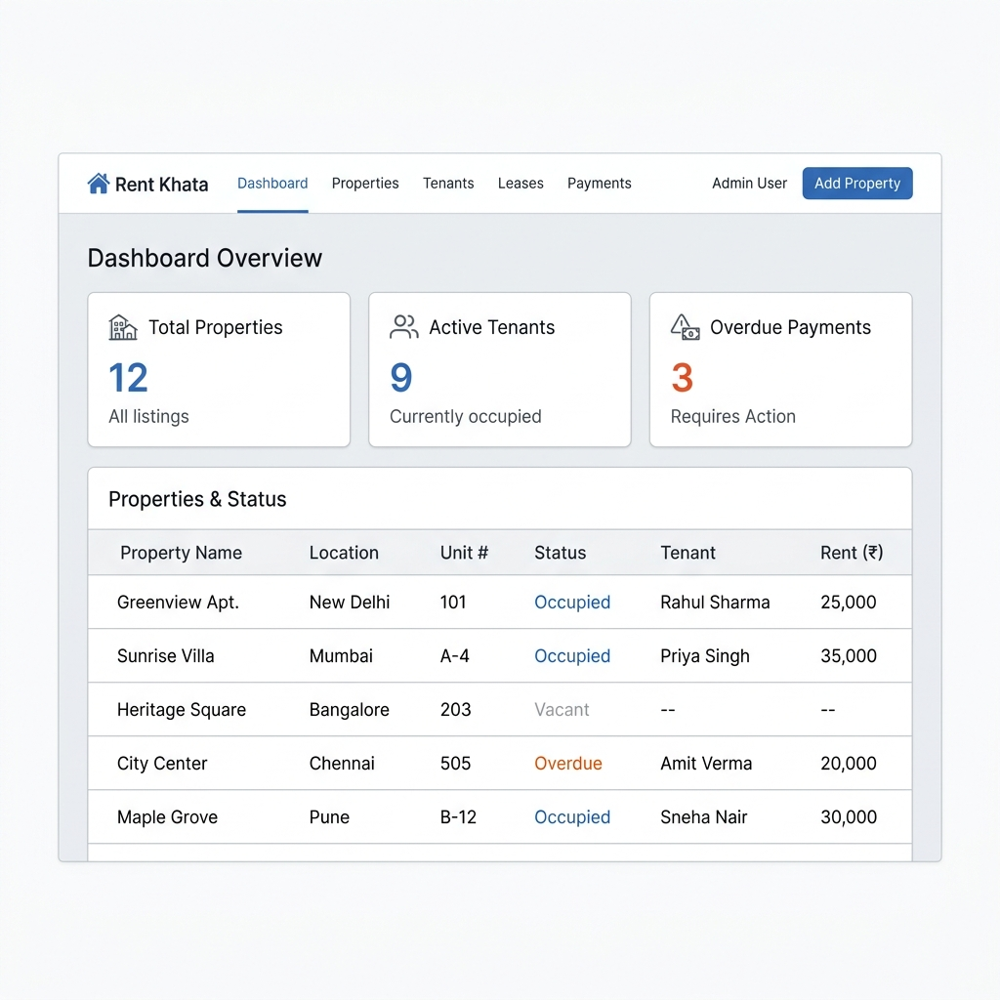

# 🏠 Rent Management System (Rent Khata)

[](https://nextjs.org/)
[](https://reactjs.org/)
[](https://expressjs.com/)
[](https://www.postgresql.org/)
[](https://tailwindcss.com/)

A premium, full-stack rent management solution designed for property owners to effortlessly manage properties, units, tenants, and automated rent collection. 



---

## ✨ Key Features

### 🏢 Property & Unit Management
- **Hierarchical Structure**: Organize units under specific properties.
- **Unique Unit Validation**: Prevent duplicate unit names within the same property.
- **Dynamic Editing**: Seamlessly update property and unit details (rent, name, etc.).
- **Detailed Unit View**: Deep-dive into specific unit history, current tenancy, and tenant details.

### 👥 Tenant & Tenancy
- **Streamlined Onboarding**: Easily assign tenants to units with lease terms.
- **Lease Tracking**: Keep track of move-in dates and lease durations.
- **Payment History**: Comprehensive log of all rent payments for each tenant.

### 💰 Automated Rent & Fines
- **Cron-based Generation**: Automated monthly rent billing via `node-cron`.
- **Customizable Late Fees**: Define property-specific grace periods and percentage-based late fees.
- **Smart Status Tracking**: Real-time "Pending", "Paid", and "Overdue" status indicators.
- **PDF Receipts**: Professional, downloadable payment receipts generated via PDFKit.

### 📱 Premium UX/UI
- **Responsive Design**: Fully optimized for Desktop, Tablet, and Mobile views.
- **Modern Aesthetics**: Sleek dark mode, glassmorphism effects, and vibrant status badges.
- **Global Notifications**: Real-time feedback for actions like creation, updates, and errors.

---

## 🛠️ Tech Stack

| Layer | Technology | Key Libraries |
| :--- | :--- | :--- |
| **Frontend** | **Next.js 16** (App Router) | React 19, Axios, Tailwind CSS 4 |
| **Backend** | **Express 5** | Node.js, JWT, bcrypt, node-cron, PDFKit |
| **Database** | **PostgreSQL** | `pg` (Pool), Zod (Validation) |
| **Email** | **SendGrid** | `@sendgrid/mail` |

---

## 🏗️ Project Structure

```text
rent-management-system/
├── client/                 # Next.js frontend
│   ├── app/                # App router (pages, layout, styles)
│   ├── public/             # Static assets
│   └── scripts/            # Custom Next.js runner (memory-optimized)
├── server/                 # Express backend
│   ├── src/                # Source code (MVC-like pattern)
│   │   ├── modules/        # Domain modules (auth, rent, property, etc.)
│   │   ├── middleware/     # Auth and error handling
│   │   └── config/         # DB and environment setup
│   └── sql/                # Database schema (domain.sql)
├── assets/                 # README documentation assets
└── package.json            # Root workspace scripts
```

---

## 🚀 Getting Started

### 1. Prerequisites
- **Node.js** (v18 or higher)
- **PostgreSQL** (v14 or higher)
- **SendGrid API Key** (for email notifications)

### 2. Installation

```bash
# Clone the repo
git clone https://github.com/Priyanshu-1190/rent-management-system.git
cd rent-management-system

# Install dependencies (Root, Client, and Server)
npm install
cd client && npm install && cd ..
cd server && npm install && cd ..
```

### 3. Database Setup
Create a PostgreSQL database and run the initialization script:
```bash
psql -U your_user -d your_db -f server/sql/domain.sql
```

### 4. Environment Configuration
Create a `.env` file in the `server/` directory:
```env
# Database
DB_USER=your_user
DB_HOST=localhost
DB_NAME=rent_management
DB_PASSWORD=your_password
DB_PORT=5432

# Server
PORT=5000
JWT_SECRET=your_super_secret_key
CLIENT_URL=http://localhost:3000

# Notifications
SENDGRID_API_KEY=your_api_key
SENDGRID_FROM_EMAIL=noreply@yourdomain.com

# Settings
SCHEDULER_TIMEZONE=Asia/Kolkata
```

### 5. Running the Application
```bash
# Start both client and server concurrently
npm run dev
```
The client will be available at `http://localhost:3000` and the server at `http://localhost:5000`.

---

## 📄 API Overview

- **Auth**: `/api/auth/register`, `/api/auth/login`
- **Properties**: `/api/properties` (CRUD)
- **Units**: `/api/units` (CRUD, Detailed view)
- **Tenancies**: `/api/tenancies`
- **Rent**: `/api/rent/generate`, `/api/rent/pay/:id`
- **Dashboards**: `/api/dashboard/owner`, `/api/dashboard/tenant`
- **Receipts**: `/api/receipts/:id` (Download PDF)

---

## 🛡️ License

This project is licensed under the Commons Clause + GNU Affero General Public License v3.0. See the [LICENSE](LICENSE) file for the full terms. Note: the Commons Clause places a restriction on commercial use — contact the repository owner for a commercial license request.

